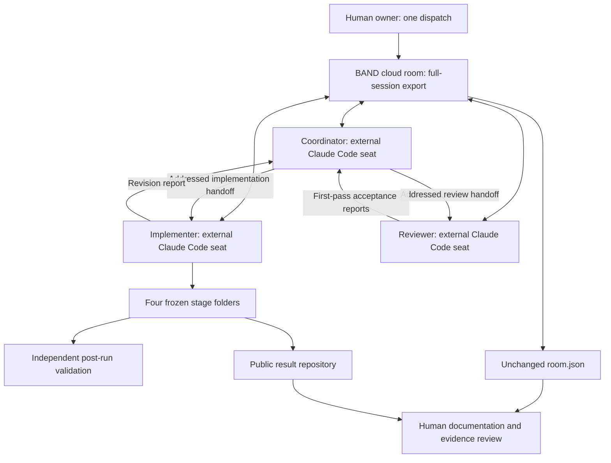
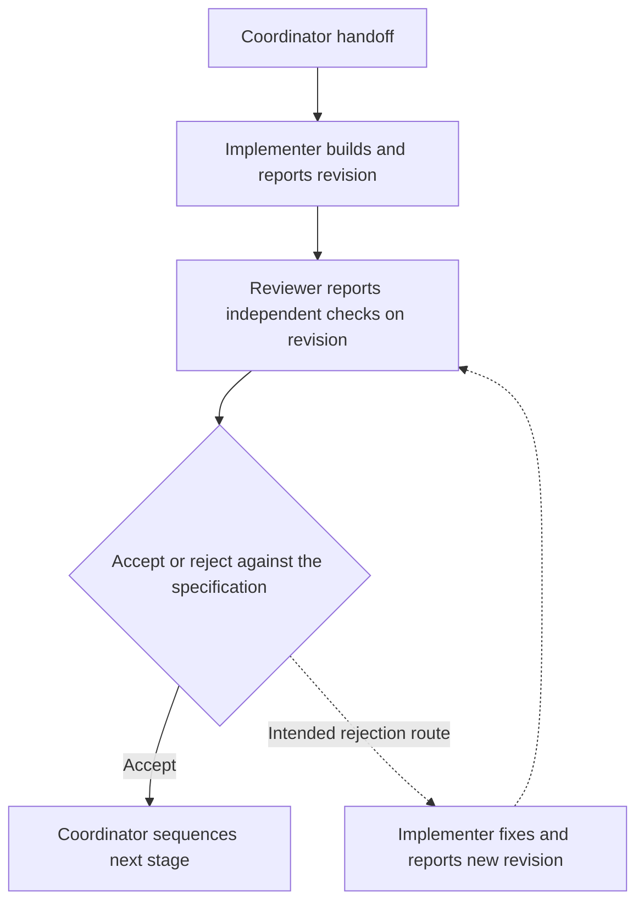

# Reviewed factory diagrams

Source boundary: unchanged full-session export at result source revision `1042011`, with its timing audit in [../validation/room-audit.json](../validation/room-audit.json). This document is a post-run evidence review, not an agent artifact, dispatch or submission receipt. The upstream documentation additions at `d11226f` did not change stage source, mandates or the room export.

## Architecture

Mandate model headers describe configuration, not independently established effective runtime identities. Oracle host capacity and USD 176.20 list-price cost are operator reports; the room export supplies no token counters. Post-run service-container validation does not prove provider seats were sandboxed. SDK/cloud-room footage eligibility remains subject to organiser clarification.

## Acceptance flow

All four stages were accepted on first review in this exported room. The rejection route is a mandate rule, not an observed rejection/fix episode. Zero rejections is not evidence of complete requirement coverage and does not by itself reduce the score. The proposed run 2 coverage matrix and fourth auditor were not part of run 1.

## Recorded timeline (UTC, 2026-10-04)

| Event | Timestamp | Evidence scope |
|---|---|---|
| First exported setup event | 20:51:31.554 | Beginning of exported room interval |
| Only human dispatch | 20:53:18.700 | Beginning of autonomous production interval |
| Coordinator final text report | 22:07:03.747 | End of dispatch-to-report interval |
| Last exported event | 22:07:11.968 | End of exported room interval |

Dispatch to final text report: **73 minutes 45.047 seconds**. Full room interval: **75 minutes 40.414 seconds**, approximately 76 minutes including setup. There is one human dispatch and no later human message in the export. Per-stage implementation/review durations are not independently established by this diagram; no invented partitions or token-per-seat timeline are shown.

## Validation boundaries

The separate post-run reproduction passed 147, 182, 188 and 193 required shipped checks across stage folders: 710 cumulative checks, including repeated inherited suites. An earlier exact official all-stage CLI attempt failed during runner dependency setup. On 5 October the exact all-stage command independently passed from fresh public clones at review revision `b493eb4`, with 710 cumulative required checks and exit 0. The [official receipt](../validation/official-cli-run-20261005.json) and previous failures are preserved separately; none establishes hidden-test coverage or a judging result. These 710 checks repeat the same shipped contracts; do not add two runs together as unique coverage.

## Retained operator illustrations

The `.drawio`, `.drawio.svg`, `.drawio.png` and `.mmd` files alongside this document came from the operators' upstream additions. They remain unchanged for provenance. Their model, timing, usage and coverage labels are not reviewed measurements and can conflict with the audit above. The original PDF was also updated upstream; the separately named evidence-review PDF retains its own edit provenance. Use the reviewed values above when preparing final materials; do not present an original illustrative timeline as recorded execution evidence.

[Documentation review checks](../validation/upstream-documentation-review-20261005.json) record link validation, the UTF-8 checker result and the frozen-source comparison.
